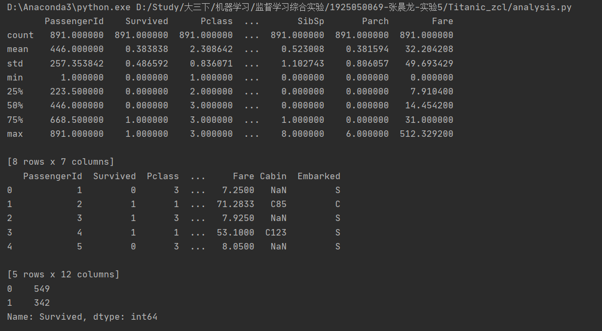
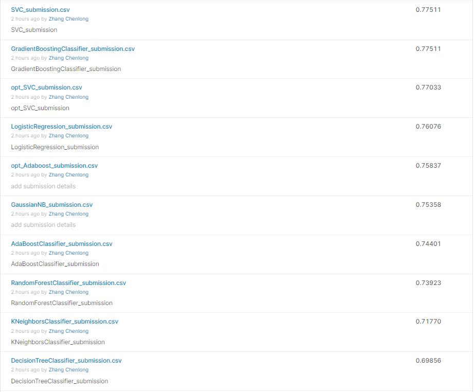

# Cl Zhang's Titanic 监督学习综合实验
## Author
* Chenlong Zhang
## Catalog
* 问题及数据集简介
* 数据集的分析
* 数据预处理
* 模型的选择、训练和预测
* 模型效果的评价及解释
* 参数调优
* 结果提交
* 总结
## 问题及数据集简介
_问题是以大家熟悉的泰坦尼克号为背景展开的，本次任务的目的就是构建一个可以根据乘客个人信息，如性别、年龄、船舱等级等来推测乘客是否生存的**分类模型**。_
## 数据集的分析
* **训练集：**

文件名为“titanic_train.csv”,文件中的数据共有891行和12列，这代表本训练集共有891条数据，每条数据有12类属性。这12个属性的列名和含义如下所示：

| 属性名 | 属性含义 |
|----|----|
|PassengerId|乘客ID|
|Survived|获救情况（1为获救，0为未获救)|
|Pclass|船舱等级(1/2/3等舱位)|
|Name|乘客姓名|
|Sex|性别|
|Age|年龄|
|SibSp|乘客在船上的兄弟/姐妹个数|
|Parch|乘客在船上的父母与小孩个数|
|Ticket|船票编号|
|Fare|票价|
|Cabin|舱位|
|Embarked|登船港口|

* **测试集：**

文件名为“titanic_test.csv”,文件中的数据共有418行和11列，与训练集相比少了Survived属性。

* **探索性数据分析**[[analysis.py]](analysis.py)
1. 描述性统计分析,确定无用数据
经过分析，PassengerId, Name, Ticket, Cabin(其不好进行归类或处理为离散值，且存在大量缺失值)为干扰数据，可直接删去
2. 检查各个属性值中是否有缺失值

经过分析，以上三个属性存在缺失值，故后续操作需要补全/直接删去
3. 检查各个属性值的类型：连续值（需要归一化）、字符值（需要处理为离散值）
通过describe函数直接观察:

需要转换为离散值的属性：Sex, Embarked

需要归一化的属性值：Age, Fare

4. 相关性分析
通过相关性分析可以得出初步的结论：

与存活率成正相关: Fare, Parch

与存活率成负相关: Pclass, Sex, Age, SibSp, Embarked

需要说明的是Sex和 Embarked是由字符型数值转变的，因此其正负相关的判别与转换编码的形式有关，无实际意义
## 数据预处理
[[preprocess.py]](preprocess.py)

数据的预处理包括：数据的清洗、数据的采样、数据集拆分、特征选择、特征降维、特征编码、规范化等。

scaleList: ['Age', 'Fare'] 

* 无关特征的删除:
    * 有些项对预测分析是没有帮助的，可以直接删除。通过分析：uselessList: ['PassengerId', 'Name', 'Ticket', 'Cabin']直接删除 
* 缺失值填充
    * nanList: ['Age', 'Cabin', 'Embarked'] 存在缺失值，在训练时直接将缺失记录删除，在测试时将缺失值用上一条/下一条有效记录填充（需要说明的在测试时，这样的操作会导致测试精度下降）
* 编码转换
    * strList: ['Sex', 'Embarked'] “性别”和“登船港口” 列的属性值是字符型，需要进行转换，把这些类别映射到一个数值。（Sex:0, 1; Embarked:0, 1, 2）
* 数据缩放
    * scaleList: ['Age', 'Fare'] “年龄”和“票价”两列的属性值相对其他列明显太大，在模型训练中会影响模型的准确性，因此需要把这两列的数值变换到一个0-1之间的数值。b在本方案中使用了Z-score归一化

处理前后数据：

## 模型的选择、训练和预测

要求：

**在学习过的分类算法中至少选择3种**分别进行模型的选择、训练和预测

Chenlong Zhang中使用的方法：
LogisticRegression

DecisionTreeClassifier

KNeighborsClassifier 

SVC

GaussianNBAdaBoostClassifier

RandomForestClassifier

GradientBoostingClassifier

使用了10折交叉验证计算，得到训练集和测试集的准确率，并画出混淆矩阵
准确率：

混淆矩阵：

## 模型效果的评价及解释

要求：

使用**多次交叉验证法**评价不同的模型；
要说明实验过程中是否有过拟合现象，若有，是如何处理的。

通过观察上述10折交叉验证的准确率，可以看到对于决策树算法，画出决策树：

发现，当决策树的深度特别深特别深以至于叶子节点中的对象只剩下一个或者很少，导致决策树的模型过于复杂，容易造成过拟合问题，泛化能力下降。因此可以通过预剪枝解决此问题。

## 参数调优

大多数机器学习算法都包含大量的参数，使用最适合数据集的参数才能让机器学习算法发挥最大的效果。但各种参数的排列组合数量巨大，这时使用自动化参数调优就可以在很大程度上减少工作量并提升工作效率。下面介绍一种常用的参数调优方法——暴力搜索。

暴力搜索寻优：网格搜索为自动化调参的常见技术之一，Scikit-learn提供的GridSearchCV函数可以根据给定的模型自动进行交叉验证，通过调节每一个参数来跟踪评分结果。从本质上说，该过程代替了进行参数搜索时使用的for循环过程。

通过网格搜索法，得到部分最优的超参数如表格所示：

|模型| 超参数|Best Train Acc|Best Val Acc|
|:----|----|----|----|
|DecisionTreeClassifier|'criterion': 'gini', 'max_depth': 16, 'max_leaf_nodes': 40|0.83|0.73
|KNeighborsClassifier|'n_neighbors': 11|0.82|0.75|
|SVC|'C': 1, 'gamma': 0.1, 'kernel': 'rbf'|0.82|0.83|
|GaussianNBAdaBoostClassifier|'learning_rate': 0.5, 'n_estimators': 300|0.80|0.81|
|RandomForestClassifier|'n_estimators': 700|0.78|0.77|
|GradientBoostingClassifier|'learning_rate': 0.1, 'n_estimators': 100|0.82|0.78|
将调参后的模型与调参前的数据进行对比，如图所示：

可以看到参数调优后，大部分模型的性能均有所上升，但是同时对于部分模型也出现了过拟合的情况
## 结果提交
将普通模型的结果和调优模型的结果提交至Kaggle平台
[[Kaggle]](https://www.kaggle.com/competitions/titanic)
最终得分如图所示：

## 总结

本次实验主要是使用多个机器学习的模型，预测泰坦尼克号生还人员，是一个二分类问题。使用到的技术主要有：
* pandas：数据操作，通过pandas库对csv文件进行操作，并用dataframe读取、检索、遍历、操作数据
* seaborn/matplotlib：绘制图像，用这两个库绘制柱状图、热力图、树状图等，用于数据处理后的分析、模型性能、泛化能力的评估以及对比
* sklern：调用机器学习模型，并对模型进行训练、调优，对数据集进行预测，得出结果。

本次实验主要包含了数据集的分析、预处理，模型选择、训练和评估，模型调优等过程

通过此次实验，主要是提升了使用机器学习模型解决实际问题的能力，加深对于机器学习模型的理解，巩固了构建机器学习完成工程的代码能力。